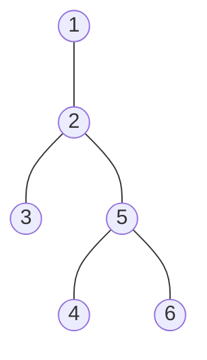
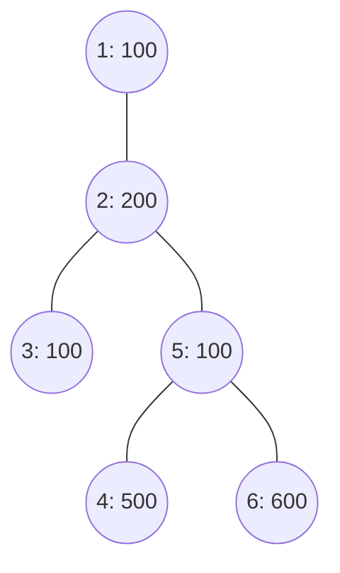
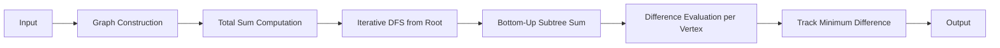

Tree partitioning problem solved using a single-pass DFS to compute subtree sums and find the minimum-difference edge cut.
| Property   | Details                          |
| ---------- | --------------------------------- |
| Platform   | HackerRank                        |
| Domain     | Graph Theory / Trees              |
| Algorithm  | DFS                                |
| Technique  | Subtree Sum Accumulation           |
| Language   | Python                             |
| Complexity | O(n)                               |
| Space      | O(n)                               |

 Table of Contents
- [A. Problem Title](#cut-the-tree)
- [B. Problem Statement](#b-problem-statement)
- [Tree Model](#tree-model)
- [Key Observation](#key-observation)
- [E. Solution Steps / Algorithm](#e-solution-steps--algorithm)
- [Flowchart](#flowchart)
- [DFS Traversal Visualization](#dfs-traversal-visualization)
- [Pseudocode](#pseudocode)
- [Correctness](#correctness--why-the-algorithm-works)
- [Example Walkthrough](#example-walkthrough)
- [Edge Cases](#edge-cases)
- [Complexity Analysis](#complexity-analysis)
- [Data Structures Used](#data-structures-used)
- [Why Iterative DFS](#why-iterative-dfs)
- [Technical Pipeline](#technical-pipeline)
- [C. Problem Link](#c-hackerrank--leetcode-link)
- [D. GitHub Repository](#d-students-github-link)
- [F. Code Developed](#f-code-developed)
- [Repository Structure](#repository-structure)
- [Summary](#final-technical-summary)

B. Problem Statement

We are given an undirected tree with `n` vertices, numbered `1` to `n` and always rooted at vertex `1`. Each vertex holds an integer data value, and the *sum* of a tree is the total of all its vertices' data values.

Removing any single edge from the tree splits it into exactly two smaller trees. The *difference* between these two resulting trees is defined as the absolute value of the difference between their sums.

The task is to decide which one edge to cut so that the two resulting trees have the **minimum possible difference**, and to return that minimum difference.

**Input parameters**

| Symbol      | Meaning                                                          |
| ----------- | ----------------------------------------------------------------- |
| `n`         | Number of vertices in the tree                                    |
| `data[i]`   | Data value stored at vertex `i`                                   |
| `edges[j]`  | A pair `(u, v)` representing an undirected edge between vertices `u` and `v` |

**Output**

A single integer representing the minimum achievable absolute difference between the sums of the two trees formed by cutting one edge.

**Constraints (as per problem statement)**

- `2 ≤ n ≤ 10^5`
- `1 ≤ data[i] ≤ 10^4`
- The graph is always a valid tree (connected, `n − 1` edges, no cycles) rooted at vertex `1`.

The statement above is a rewritten technical restatement of the original HackerRank problem, not a verbatim copy of the platform's wording.

---

Tree Model

The problem is a direct application of subtree-sum reasoning on a rooted tree:

| Real-world entity          | Graph entity                     |
| --------------------------- | --------------------------------- |
| Vertex                      | Node holding a data value          |
| Edge                        | Undirected connection between two nodes |
| Removing an edge            | Splitting the tree into two disjoint components |
| Subtree rooted at a child   | One side of a potential cut       |

Because the tree is rooted at vertex `1`, every edge can be viewed as a **parent–child** connection. Cutting the edge between a node and its parent always separates the tree into exactly two pieces: the node's own subtree, and everything else. This framing is what lets the whole problem be solved with a single traversal instead of re-evaluating the tree from scratch for every candidate cut.

---

Key Observation

For any non-root vertex `v` with subtree sum `S(v)`, cutting the edge between `v` and its parent produces:

- One tree with sum `S(v)` (the subtree rooted at `v`)
- One tree with sum `total − S(v)` (everything else)

```
difference(v) = | total − 2 × S(v) |
```

Once the subtree sum of every vertex is known, the answer is simply the minimum of `difference(v)` over all non-root vertices `v`. This turns an apparently combinatorial "try every edge" problem into a single bottom-up accumulation over the tree.

---

E. Solution Steps / Algorithm

1. **Read the input** — parse `n`, the `data` array, and the `n − 1` edges.
2. **Build the adjacency list** — convert the edge list into an adjacency representation for O(1) neighbor lookups.
3. **Compute the total sum** — sum all values in `data` once, up front.
4. **Root the tree at vertex 1** — run an iterative DFS from vertex 1 to establish a visitation order and a parent pointer for every other vertex.
5. **Accumulate subtree sums bottom-up** — process vertices in **reverse** DFS order, adding each vertex's own value into its subtree sum, then folding that subtree sum into its parent's subtree sum.
6. **Evaluate every possible cut** — for every non-root vertex, compute `|total − 2 × subtree_sum[vertex]|`.
7. **Track the minimum difference** across all vertices.
8. **Return the minimum difference** once every vertex has been processed.

---

Flowchart

```mermaid
flowchart TD
    A([START]) --> B[Read input: n, data, edges]
    B --> C[Build adjacency list]
    C --> D[Compute total sum of data]
    D --> E["Initialize visited[] = false"]
    E --> F[Iterative DFS from vertex 1]
    F --> G[Record visitation order and parent pointers]
    G --> H[Process vertices in reverse order]
    H --> I["subtree_sum[v] += data[v]"]
    I --> J["subtree_sum[parent[v]] += subtree_sum[v]"]
    J --> K{More vertices to process?}
    K -- YES --> H
    K -- NO --> L[For each non-root v: diff = |total - 2*subtree_sum[v]|]
    L --> M[Track minimum diff]
    M --> N([Return minimum diff])
```

---

DFS Traversal Visualization



Starting DFS at vertex `1`, one possible traversal order is:

```
Visit 1 → Visit 2 → Visit 3 → Visit 5 → Visit 4 → Visit 6
```

This order depends on the adjacency list's internal ordering and is shown here as one representative example. Regardless of traversal order, processing vertices in **reverse** of whatever order was recorded guarantees every child is folded into its parent before the parent itself is used — that reverse-order guarantee is the only property the algorithm actually relies on.

---

Pseudocode

```
FUNCTION cutTheTree(data, edges)

    n = LENGTH(data)
    total = SUM(data)
    BUILD adjacency list FROM edges

    visited = ARRAY of size (n + 1), all FALSE
    parent  = ARRAY of size (n + 1), all 0
    order   = EMPTY LIST

    stack = [1]
    visited[1] = TRUE

    WHILE stack is NOT EMPTY
        node = POP stack
        APPEND node TO order
        FOR neighbor IN adjacency[node]
            IF visited[neighbor] == FALSE
                visited[neighbor] = TRUE
                parent[neighbor] = node
                PUSH neighbor ONTO stack

    subtree_sum = ARRAY of size (n + 1), all 0

    FOR node IN REVERSE(order)
        subtree_sum[node] += data[node - 1]
        IF parent[node] != 0
            subtree_sum[parent[node]] += subtree_sum[node]

    min_diff = INFINITY
    FOR node IN order
        IF node != 1
            diff = ABS(total - 2 * subtree_sum[node])
            min_diff = MIN(min_diff, diff)

    RETURN min_diff
```

---

Correctness / Why the Algorithm Works

1. **Every edge corresponds to exactly one parent–child pair.** Since the tree is rooted at vertex `1`, every edge in the tree connects some vertex to its unique parent, so enumerating "cut the edge above vertex `v`" for every non-root `v` enumerates every possible cut exactly once.
2. **Subtree sum fully determines the cut's difference.** Once an edge above `v` is cut, one side is precisely `v`'s subtree and the other side is precisely everything not in that subtree — there is no ambiguity about which vertices land on which side.
3. **Reverse-order accumulation is valid because it respects dependency order.** A parent's subtree sum can only be finalized after all of its children's subtree sums are finalized; processing in the reverse of a DFS discovery order guarantees children are always handled before their parent.
4. **Taking the minimum over all non-root vertices yields the global optimum**, since every candidate cut has been evaluated exactly once with no cut skipped or double-counted.

---

Example Walkthrough

**Input**

```
n = 6
data = [100, 200, 100, 500, 100, 600]
edges = [(1,2), (2,3), (2,5), (4,5), (5,6)]
```



Total sum = `100 + 200 + 100 + 500 + 100 + 600 = 1600`.

| Edge cut (above vertex) | Subtree sum | Difference = \|total − 2×sum\| |
| ------------------------ | ----------- | -------------------------------- |
| 2                        | 900         | \|1600 − 1800\| = 200            |
| 3                        | 100         | \|1600 − 200\| = 1400            |
| 5                        | 1200        | \|1600 − 2400\| = 800             |
| 4                        | 500         | \|1600 − 1000\| = 600             |
| 6                        | 600         | \|1600 − 1200\| = 400             |

The minimum difference is **400**, which matches the expected output for this input.

---

Edge Cases

| Edge Case                          | Expected Behaviour                                              |
| ------------------------------------ | ----------------------------------------------------------------- |
| `n = 2`                              | Only one possible edge; that edge's cut is the answer by default |
| All vertices have equal data values  | Minimum difference favors cuts closest to splitting the tree in half by vertex count |
| Skewed tree (a long path)            | Iterative DFS avoids recursion-depth issues that a recursive DFS could hit |
| Star-shaped tree (root with many children) | Every leaf's subtree sum equals its own value; minimum difference is found directly among the leaves |
| Large `n` (close to 10^5)            | O(n) traversal and O(n) space keep the solution within time and memory limits |

---

Complexity Analysis

Let `n` be the number of vertices in the tree (so there are exactly `n − 1` edges).

**Graph construction**

Each edge is inserted into the adjacency list twice (once for each direction of the undirected edge):

```
O(n)
```

**DFS traversal and subtree-sum accumulation**

Every vertex is pushed and popped from the stack exactly once (guarded by the `visited` check), and every vertex is processed exactly once during the reverse-order accumulation pass:

```
O(n)
```

**Overall**

| Phase                          | Time     | Space    |
| -------------------------------- | -------- | -------- |
| Adjacency list construction      | O(n)     | O(n)     |
| Iterative DFS ordering           | O(n)     | O(n)     |
| Subtree sum accumulation         | O(n)     | O(n)     |
| Minimum difference evaluation    | O(n)     | O(1)     |
| **Total**                        | **O(n)** | **O(n)** |

Each vertex and edge is touched a constant number of times, so the overall algorithm is linear in the size of the tree.

---

 Data Structures Used

| Data Structure           | Purpose                                       |
| --------------------------- | ------------------------------------------------ |
| `defaultdict(list)`         | Adjacency list representation of the tree          |
| `list` (as an array)        | Visited-state, parent pointers, and subtree sums per vertex |
| `list` used as a stack       | Explicit stack for iterative DFS                    |
| `list` (`order`)             | Records DFS visitation order for the reverse pass    |

---

Why Iterative DFS?

The implementation uses an explicit stack rather than recursive function calls for the DFS traversal. For trees with a large number of vertices (skewed or path-like trees in particular), recursive DFS can approach Python's default recursion limit. Using an explicit stack avoids this dependency entirely and keeps memory usage predictable. This is a practical implementation choice for the given constraints rather than a fundamental algorithmic requirement.

 Technical Pipeline



C. HackerRank / LeetCode Link

**Problem:** Cut the Tree
**Platform:** HackerRank
**Link:** [Cut the Tree — HackerRank](https://www.hackerrank.com/challenges/cut-the-tree/problem)

---

D. Student's GitHub Link

[GitHub Repository](https://github.com/NAVYAS367/cut-the-tree)

The repository linked above contains:

- This `README.md`
- The Python source code (`cut_the_tree.py`)
- A supporting report/documentation file

---

F. Code Developed

The solution is implemented in Python and follows the algorithm described in the sections above. Key implementation characteristics:

- Graph represented using an adjacency list (`defaultdict(list)`)
- Tree rooted at vertex 1 and traversed using **iterative DFS** (explicit stack, no recursion)
- Subtree sums accumulated bottom-up in a single reverse-order pass
- Minimum difference computed in one additional linear pass over all non-root vertices
- Standard input read directly via `input()` for HackerRank-style STDIN test cases

The full source code is not reproduced in this README. It is available separately in this repository as:

```
cut_the_tree.py
```

---

Repository Structure

```
cut-the-tree/
│
├── README.md
├── cut_the_tree.py
└── report/
    └── Cut_the_Tree_Report.pdf
```

| File                                | Description                                                  |
| -------------------------------------- | ------------------------------------------------------------- |
| `README.md`                            | This document — problem explanation, algorithm, and analysis |
| `cut_the_tree.py`                      | Python implementation of the solution                        |
| `report/Cut_the_Tree_Report.pdf`       | Supporting written report/documentation                      |

---

Final Technical Summary

```
Problem
  → Tree Modeling (rooted at vertex 1)
    → Total Sum Computation
      → Iterative DFS (traversal order + parent pointers)
        → Bottom-Up Subtree Sum Accumulation
          → Per-Vertex Difference Evaluation
            → Minimum Difference Selection
```
